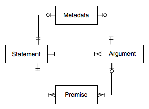

# Argument Graphs

Argument graphs model relationships among arguments and statements
(claims, propositions). The arguments represented in an argument
graph can be new (invented) arguments *constructed* from knowledge,
evidence and facts, or *reconstructed* from arguments in source
documents, such as court opinions or newspaper commentaries.

Argument reconstruction is a challenging task requiring the
interpretation of natural language texts. Consider
the following simple legal argument: Johnny violated the law by riding
his skateboard in the park.

This same argument can be expressed in many different ways in natural
langauge.  Here are some examples:

1. Because Johnny rode his skateboard in the park he violated the law.
2. Vehicles are prohibited in the park. Someone who does something
   which is prohibited violates the law. Johnny rode his skateboard in
   the park. A skateboard is a vehicle. Therefore Johnny violated the
   law.
3. Johnny hat gegen das Gesetz verstoßen, weil er sein Skateboard im
   Park benutzt hat.

The first example just reordered the premise and the conclusion of the
argument, putting the premise first. The second example reveals some
implicit premises of the original formulation of the argument. The
third example is a German translation of the original formulation of
the argument.

All four of these texts, including the original formulation, express
the *same* argument, but in different ways. In a large-scale debate,
for example about European policy issues, the same argument might be
expressed in *thousands* of different ways in many different
languages. (The European Union has 23 official languages.)

One of the purposes of argument graphs is to provide a way to
summarize the arguments put forward in complex debates with exactly
one node in the graph for each argument, no matter how often or in how
many ways it has been expressed. A single argument graph is used to
represent all the arguments put forward in a debate, from all
participants. The nodes can quote one or more source documents, and
include links to these source documents, so no information need be
lost and all voices can still be heard, inclusively. Grouping the
different formulations of an argument together into a single node in
the graph, abstracting away details, makes it possible to quickly
obtain an overview of the arguments and to obtain a clearer picture of
relationships among arguments. A hypertext or map of the source
documents directly, without an argument graph, would make it difficult
to "see the forest for the trees".

Argument graphs are also useful as a decision-support tool when
analysing problems and issues, such as legal issues, whether by an
invidual or in a group. When used this way, the arguments in the graph
represent inference steps and dependencies between
propositions. Original arguments can be entered or edited directly by
users, whether or not the arguments have first been formulated in some
natural language text. If the relevant knowledge of the application
domain has been formally represented, using a knowledge-based system,
some arguments can be automatically found and entered into the graph.
Carneades provides a knowledge representation language for
argumentation schemes and an inference engine which can be used to
find arguments in this way. Both methods can be used
together. Carneades is an interactive argumentation assistant, not a
fully automatic problem-solver. Arguments which have been found
automatically can be manually edited by users.

## Data Model

The entity-relationship diagram above shows the elements of argument
graphs and their connections. (The figure does not visualize a
particular argument graph, but rather relationships between the
elements of argument graphs in general.)

The two main elements of argument graphs are statements and
arguments. Statements represent propositions, claims and
assertions. Arguments represent simple inferences from one or more
premises to a single conclusion. Again, there should be only one
statement or argument in the graph for each statement and argument in
the source documents, no matter how many different ways the statement
or argument has been expressed in source documents. Some or all
formulations of the statement or argument can be quoted or referenced
in the metadata of the statement or argument node. See the discussion
of metadata below for further information.

As can be seen in the entity-relationship diagram, arguments are
linked to statements in two ways in argument graphs. Each argument has
exactly one conclusion, which is a statement, and zero or more
premises, where each premise has exactly one statement node.  A
statement may be the conclusion or premise of more than one argument.

A statement may be both a conclusion and a premise, resulting in
complex argument graphs, representing chains or trees of
reasoning. Argument graphs may contain cycles. A simple cycle would
result if a statement is a premise and conlusion of the same
argument. There are methods for resolving these cycles when evaluating
argument graphs.

A statement in an argument graph represents a propositional variable,
whose value may be true (in), false (out) or unknown (undecided). To
continue with our example, the sentences "Johnny rode his skateboard
in the park" and "Johnny did not ride his skateboard in the park"
would be represented by a single statement in an argument
graph. Conclusions and premises of argument can negated using con
arguments and negative premises, respectively. There are two kinds of
arguments, pro and con.  An argument is pro if its conclusion claims
the statement is true and con if it claims the statement is
false. Similarly, there are two kinds of premises, positive and
negative. A positive premise holds if its statement is
"in". Conversely, a negative premise holds only if its statement is
"out".

Prior models of argument graphs did not distinguish pro and con
arguments or positive and negative premises. Rather, in these prior
approaches all argument nodes are pro and all premises are
positive. Our approach has the advantage of reducing the number of
statements up to 50%, resulting in more compact summaries of the
arguments.

## Statement Properties

id
: A Uniform Resource Name (URN) serving as a unique identifier for the
statement, world-wide.

text
: A concise formulation of the statement, written by the analyst who
reconstructed the arguments from the source documents. Paraphrases the
various formulations of the statement in the sources. Translations of
the text in several languages may be included in the model. Compare
with the "description" property of the metadata of the statement,
which can be used to quote some or all of the formulations of the
statement in the sources and provide translations in several
languages.

weight
: A real number in range of 0.0-1.0 representing the degree to which
the statement is accepted as true by users ("audience"). If the weight
is 0.0, the statement is false (rejected by the users). If the weight
is greater than 0.0 but less or equal to 0.25, the statement is
*assumed* to be false. If the weight is greater than or equal to 0.75
and less than 1.0, the statement is assumed to be true. If the weight
is 1.0, the statement is true (accepted by the users). Otherwise the
truth or falsity of the statement is at issue. In application
scenarios with many users, the weights can be collected via polls.

proof standard
: The method used to combine pro and con arguments. Several proof
standards are supported by the system. For most purposes, the
"preponderance of the evidence" standard should suffice. See the
[Editing Argument Graphs](#editing-argument-graphs) Chapter for
details.

value
: A real number in the range 0.0-1.0, storing the output of the
argument evaluation process, where 0.0 means the statement is *out*
(false or presumably false), 1.0 means the statement is *in* (true or
presumably true) and all other values mean the arguments, facts and
assumptions are insufficient for drawing any conclusions about the
truth or falsity of the statement (undecided, unknown). (Real numbers
are used to allow experimentation with other models of argument
evaluation.)

atom
: An optional formal representation of the statement in predicate
logic. (This feature is for analysts and need not interest public
users.)

main
: A Boolean value (true or false) used to indicate whether the
statement is one of the main issues modeled by the argument
graph. (Since argument graphs can contain cycles and are not limited
to trees, we cannot use the roots of trees for this purpose.)

## Argument Properties

id
: A Uniform Resource Name (URN) serving as a unique identifier for the
argument, world-wide.

direction
: Pro or con.

strict
: A Boolean value (true or false) expressing whether the conclusion of
the argument is necessarily true when its premises are true (strict
arguments) or only presumably true.  Nonstrict arguments are called
"defeasible" arguments.

scheme
: The name of the argumentation scheme applied, if
any. Optional. Examples: "argument from credible source", "argument
from practical reasoning".

weight
: A real number in range of 0.0-1.0, representing the relative weight
of the argument, compared to other arguments pro and con the
conclusion of the argument. The weight is assessed by users. If there
are multiple users, the weights can be collected using polls.

value
: A real number in in the range 0.0-1.0, used to record the output of
the argument evaluation process, where 0.0 means the argument is *out*
(not acceptable), 1.0 means the argument is *in* (acceptable) and all
other values mean the arguments in the graph, taken together, are
insufficient for determining the acceptability of this argument
(undecided/unknown). (Real numbers are used to allow experimentation
with other models of argument evaluation.)

## Premise Properties

polarity
: Positive or negative.

role
: The role of the premise in the argumentation scheme
applied. Examples: "minor", "major".

implicit
: A Boolean value (true or false). Can be used to note that the
premise was not explicit in the source documents from which the
argument node was reconstructed.

## Metadata

The argument graph as as whole, as well as each of its statements and
arguments, can be annotated with metadata, using the
[Dublin Core](http://dublincore.org/). There are 15 elements in the
Dublin Core. Each element may contain zero or more values. Here is a
list of the Dublin Core elements:

1. Title
2. Creator
3. Subject
4. Description
5. Publisher
6. Contributor
7. Date
8. Type
9. Format
10. Identifier
11. Source
12. Language
13. Relation
14. Coverage
15. Rights

See [Dublin Core](http://dublincore.org/documents/usageguide/elements.shtml)
for a detailed description and usage guidelines for each element. The
Dublin Core is intended to be useful for describing a wide range of
"resources" on the World-Wide Web. 

In addition, Carneades allows each metadata record to be assigned an
optional "key", a string which can be used as a label to refer to the
metadata record, such as "BenchCapon:2008", similar to the way
citation keys are used in bibliographic databases such as
BibTeX.^[<http://en.wikipedia.org/wiki/BibTeX>] At most one key should
be provided.

Carneades provides special support for providing description elements
of the Dublin Core in multiple languages (English, German, French, …)
and for formatting these descriptions using the
[Markdown](http://en.wikipedia.org/wiki/Markdown) language. This
feature can be used to include quotations from and links to source
documents in the descriptions of both statements and arguments.

