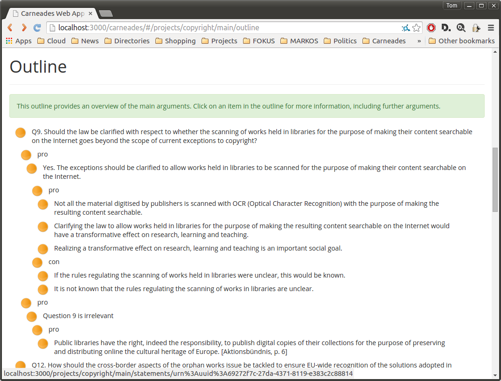
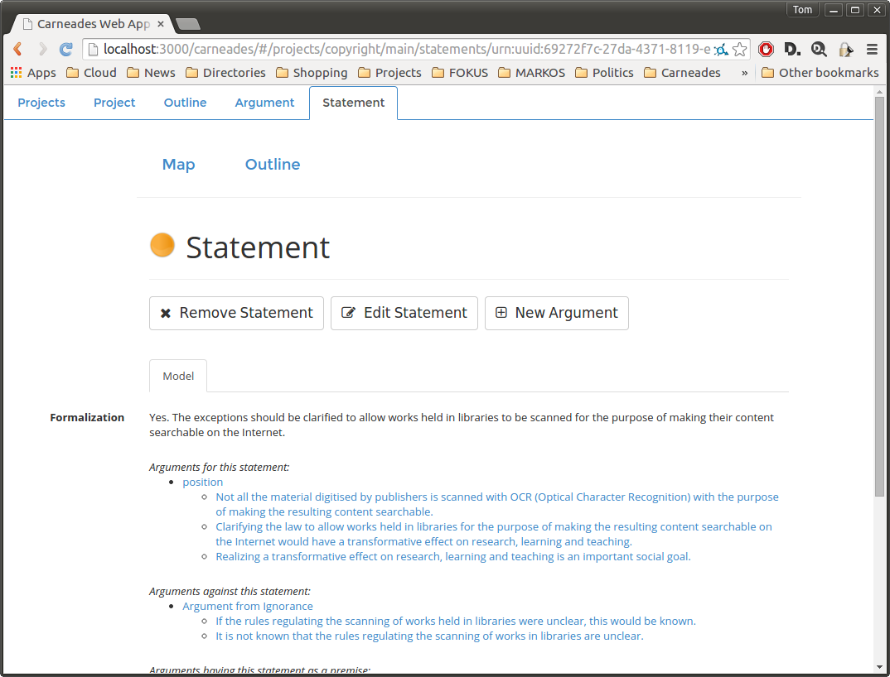
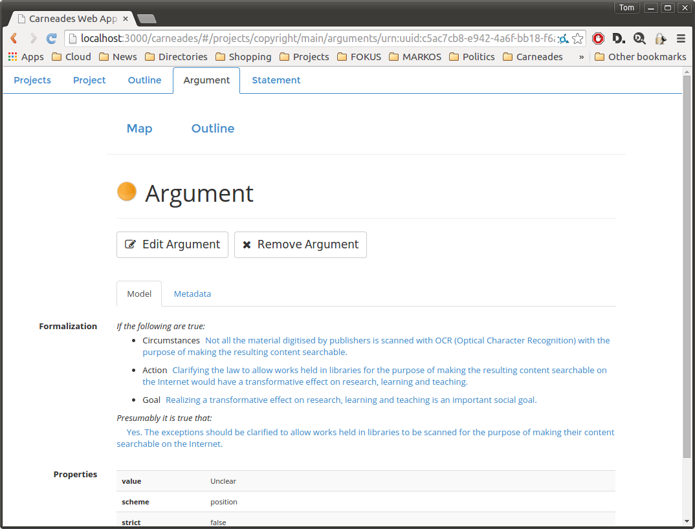
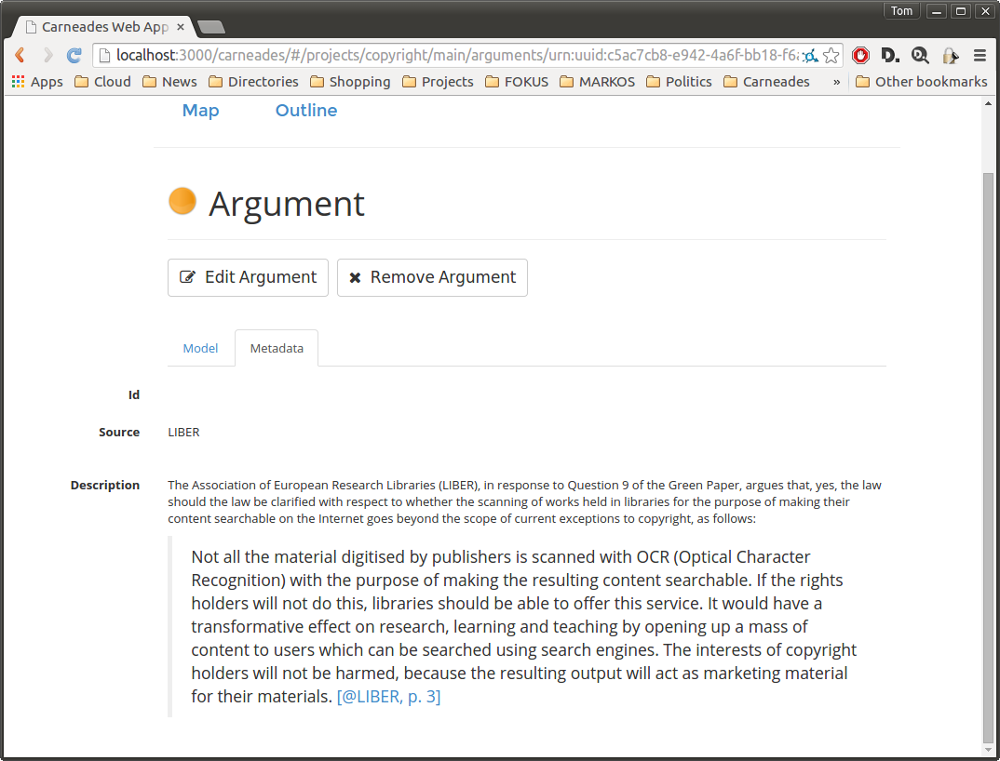
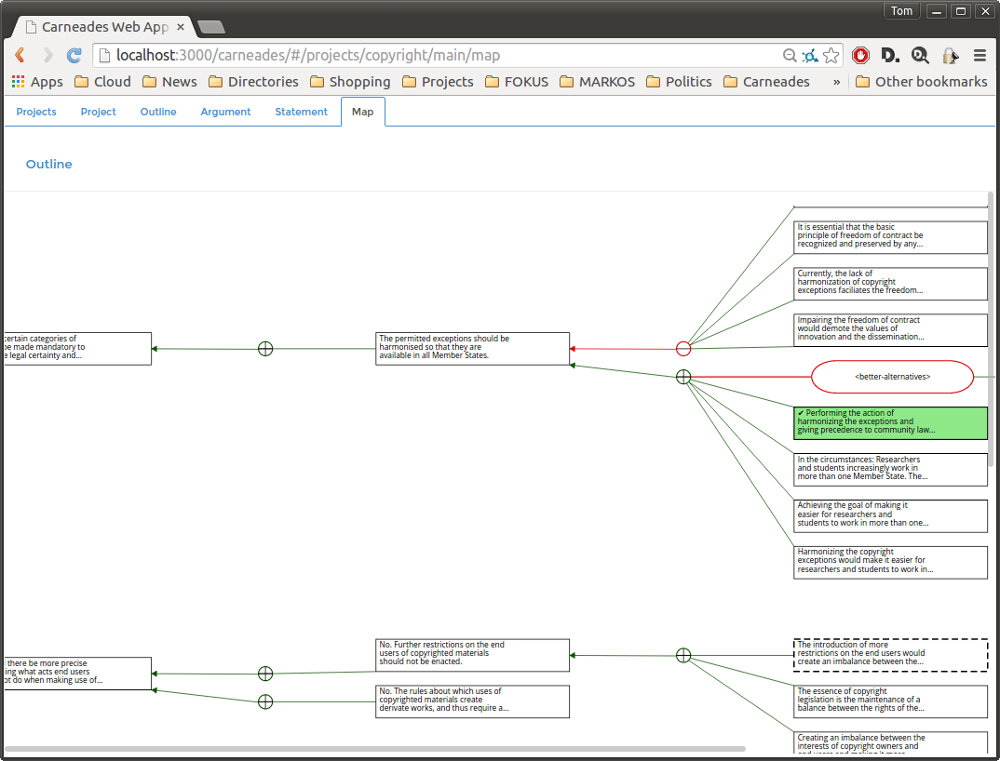
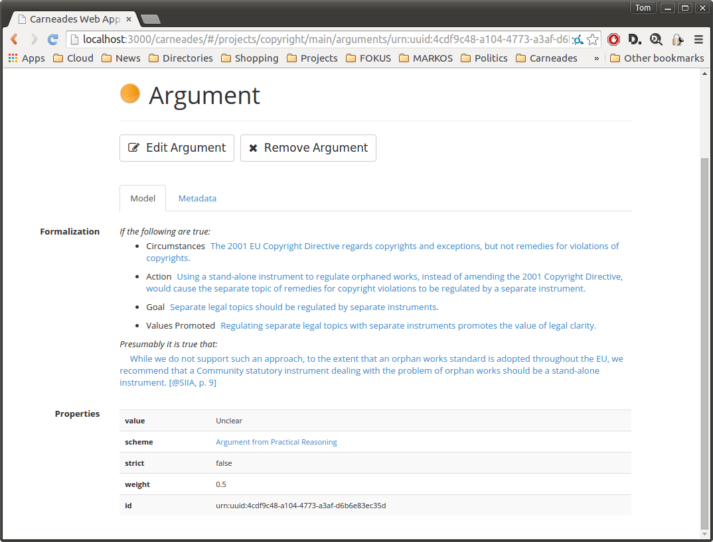
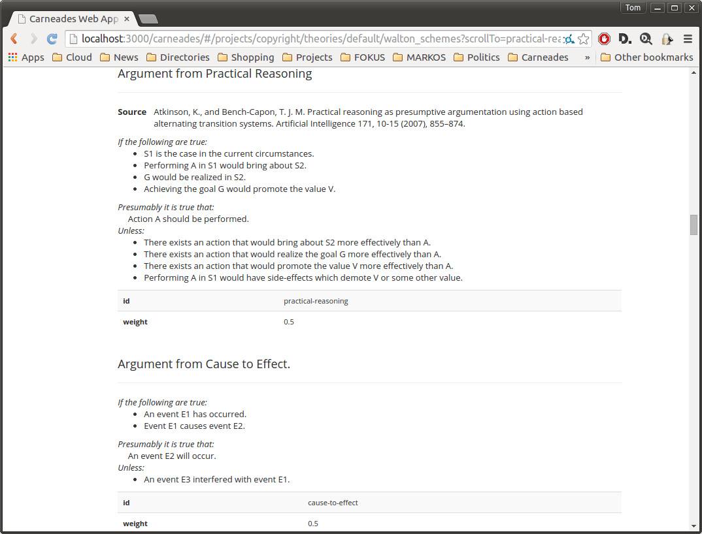

# Browsing, Visualizing and Evaluating Arguments

This chapter of the Carneades user manual explains how to:

- Access the [outline page](#the-argument-graph-page) to view
  the title, description, issues and outline of the top-level
  arguments of the argument graph.

- Use hypertext in web pages to
  [browse an argument graph](#using-hypertext-to-browse-an-argument-graph).

- [Visualizing argument graphs](#visualizing-argument-graphs-in-argument-maps)
  in diagrams, called "argument maps", and using these maps to
  navigate to more detailed views of statements and arguments.

- [Evaluate arguments](#evaluating-arguments) to reveal missing
  premises, check the form of arguments, ask critical questions and
  assess the acceptability of statements.

<!-- - [Export an argument graph to XML](#exporting-argument-graphs-to-xml),
  to archive the graph or process it using other software. -->

## The Outline Page

 

An outline page consists of the following parts:

- The *title* of the argument graph.  This title usually includes the
  topic of the discussion or debate.

- A *menu bar* of commands.

- A *description* of the topic of the discussion modeled in the
  argument graph. The description can be arbitrarily long and include
  multiple sections, paragraphs, images, hyperlinks, lists and other
  content.

- A list of the *main issues* of the discussion.  Each item in the
  list is linked to a page providing detailed information about the
  statement in the argument graph at issue.

- The outline, which presents the top five levels of the
  arguments in the argument graph. The first level of the outline
  lists the main issues (again). The second level lists the arguments
  pro and con each issue. The third level lists the premises of each
  of these arguments. The fourth level lists the argument pro and con
  each premise.  Finally, the fifth level lists the premises of these
  arguments. Deeper levels of the argument graph can be navigated to
  by first clicking on a statement or argument in the outline and then
  following the links on the next page. Since argument graphs may
  contain cycles and are not restricted to trees, some items may
  appear multiple times in the outline.

- A list of *references* to the source documents used to construct the
  argument graph.  For documents available on the Web, the reference
  will include a hyperlink to the source document.

 
 
Notice that the issues and items in the outline are prefixed with
colored dots. These indicate the current status (label) of the
statements and arguments in the graph, where:

Yellow
:   means the statement or argument is undecided or unknown.
Green
:   means the statement or argument is acceptable (in, true or presumably true).
Red
:   means the statement or argument is not acceptable (out, false or presumably false).

## Using Hypertext to Browse an Argument Graph

There is a web page for each statement and argument in the argument
graph providing detailed information about the element along with
links to related statements and arguments in the graph. You can use
these pages to navigate from node to node in the argument graph, by
simply clicking on the links in the usual way. To go back to previous
pages, use the back button of your web browser.

### Statement Pages

The proof standards available are dialectical validity, preponderance
of the evidence, clear and convincing evidence, and beyond reasonable
doubt. See the section on
[Evaluating Arguments](#evaluating-arguments) for further details
about proof standards.

The next section displays the content of the statement in natural
langauge. This formulation of the statement is written by the analyst
or analysts who reconstructed the arguments to build the argument
graph, or generated from a template in a theory, when arguments are
constructed automatically using the Carneades inference engine.

Next, arguments pro and con the statement are displayed, as well as
arguments which use this statement (or its negation) as a premise.
The premises of these arguments are also displayed. This makes it
possible to navigate to nearby arguments and statements in the
argument graph, by simply clicking on the links in these lists. 

The bottom of the statement page displays the properties of the
statement: its value, proof standard (default value: preponderance of
the evidence), weight, whether or not it is a main issue, its formal
representation as a logical atom (optional) and its id.

If metadata had been provided for the statement, it would be displayed
in a separate tab on the page. Descriptions may be provided in
multiple natural langauges, with a tab for selecting the description
in each language.

### Argument Pages

Argument pages are quite similar to statement pages. 

At the top the page, the premises and conclusion of the argument are
shown.  If available, the role of each premise in the argumentation
scheme applied is shown (e.g. "major" or "minor"). 

The bottom of the page displays the properties of the argument: its
id, the argumentation scheme applied (if any), whether it is a strict
or defeasible argument, its weight and value. The argumentation scheme
contains a hyperlink (*Note: not yet implemented*). Click on the link
to view a description of the scheme.

If metadata had been provided for the argument, it would be displayed
next. Descriptions can include quotations of one or more source texts
expressing the argument, along with hyperlinks to the sources on the
Web. 

## Visualizing Argument Graphs in Argument Maps

The menus of the argument graph page, statement pages and argument
maps include "map" and "outline" buttons.  Clicking on the "map"
button generates a diagram, called an "argument map", which visualizes
the argument graph as a network (directed graph) of statement nodes
and argument nodes connected by links. Statement nodes are shown as
boxes; argument nodes with circles and boxes with rounded corners.

For statement nodes, the text of the statement is shown inside the
box, possibly truncated if the text is too long.  In argument nodes,
the circle is filled with a plus sign, if the argument is a pro
argument, or a minus sign, for con arguments.  The edges (links)
between argument nodes and statement nodes show the premises and
conclusion of the argument. The conclusion of the argument is the
statement node pointed to by the edge with the normal arrowhead. The
other statement nodes linked to the argument, without arrowheads, are
its premises.  Negative premises are displayed with a circular (dot)
arrowhead on the statement side of the edge.

The statement and argument nodes in argument maps contain
hyperlinks. Clicking on a statement or argument node displays the
details of the node in a statement or argument page, respectively.

In argument maps, argument nodes whose conclusion is another argument
node, rather than a statement node, visualize "undercutting"
arguments. These are arguments which question the applicability of
another argument. This is the only case where two nodes of the same
time are directly connected in the map.

Argument maps are represented using structured vector graphics (SVG)
not bitmaps. You can zoom the map in or out, to any scale, without
loss of resolution. How this zooming is done depends on your device
and web browser.

When argument graphs have been evaluated, the status of the argument
and statement nodes is visualized in argument maps using both color
and icons. Nodes which are "in" are filled with a green background and
contain a checked box.  Nodes which are "out" are shown with a red
background and contain a crossed box (a box filled with an X). Nodes
which are neither in nor out are filled with white background color
and contain an empty checkbox. The colors are redundant to accommodate
black and white printing and color-blind users.

## Evaluating Arguments

By argument "evaluation" we mean the process of critically assessing
arguments by:

1. revealing implicit premises
2. validating whether the arguments are formally correct, by
   instantiating accepted argumentation schemes
3. asking appropriate critical questions, depending on the schemes
   applied
4. and determining which claims are acceptable, taking into
   consideration the assumptions of users and their collective
   assessment of the relative weights of conflicting pro and con
   arguments.

The first three of these tasks can be accomplished by comparing the
argument with its argumentation scheme. On the argument page, click on
the argumentation scheme to view a description of the scheme. Now you
can check whether any of the premises listed in the scheme are missing
from the argument. The argument is formally valid if all the premises
of the scheme are explicitly provided by matching premises of the
argument and the conclusion of the argument matches the conclusion of
the scheme.

Argumentation schemes define exceptions and assumptions which can be
used to ask critical questions. The exceptions provide reasons for not
applying the argument, undercutting it.  If an exception is true, this
doesn't mean that the conclusion of the argument is false, but only
that the argument does not provide a good reason to presume the
conclusion to be true. The assumptions of the scheme are implicit
premises which need to be proven only if they are called into
question. So, if you think an assumption does not hold, you should
make an issue of it by adding arguments pro or con the assumed
statement in the argument graph.

Any time an argument graph is modified, it is automatically
reevaluated to update the values of its arguments and statements.  A
computational model of argument is used to compute the values
[@GordonPrakkenWalton:2007a].

If you do not agree with the result of the evaluation, there are at
least three reasons why you may be right and the system's evaluation
wrong:

1. Not all relevant arguments have been included in the model, or put
   forward in the debate. If you are aware of some missing argument,
   consider adding it to the argument graph.

2. The weights assigned to the statements and arguments may not
   reflect your opinion. If these weights are averages of weights
   assigned collectively, by a group of users, you may disagree
   with the collective view. Minority views can be correct.

3. The formal model of argument we are we are using to compute
   acceptability may be incorrect. Of course, specialist knowledge is
   required to assess the correctness of the model.  If you, like most
   people, do not have this knowledge, then we recommend a skeptical
   but respectful attitude. If you agree with the results of the
   model, then the model gives you a reason to have more confidence in
   your opinion. If you do not agree with the results of the model,
   then you may want to take pause to reconsider your views, even if
   in the end you do not change your mind.

<!--

## Exporting Argument Graphs to XML

The menu bar of the argument graph page and the statement and argument
pages includes an "export" button. Click on this button to generate an
XML file containing all the data and metadata in the argument graph,
including quotations of and links to source documents.

The XML files use a schema called the "Carneades Argument Format"
(CAF), documented elsewhere.  (*Note: write the CAF documentation*)

These XML files can be used to transfer argument graphs from one
installation of the Carneades system to another, to merge argument
graphs from several sources, to archive argument graphs, or to
translate argument graphs into other formats, such as the
[Argument Interchange Format](http://www.arg.dundee.ac.uk/aif) (AIF),
or the generate reports or other kinds of visualisations..

-->
