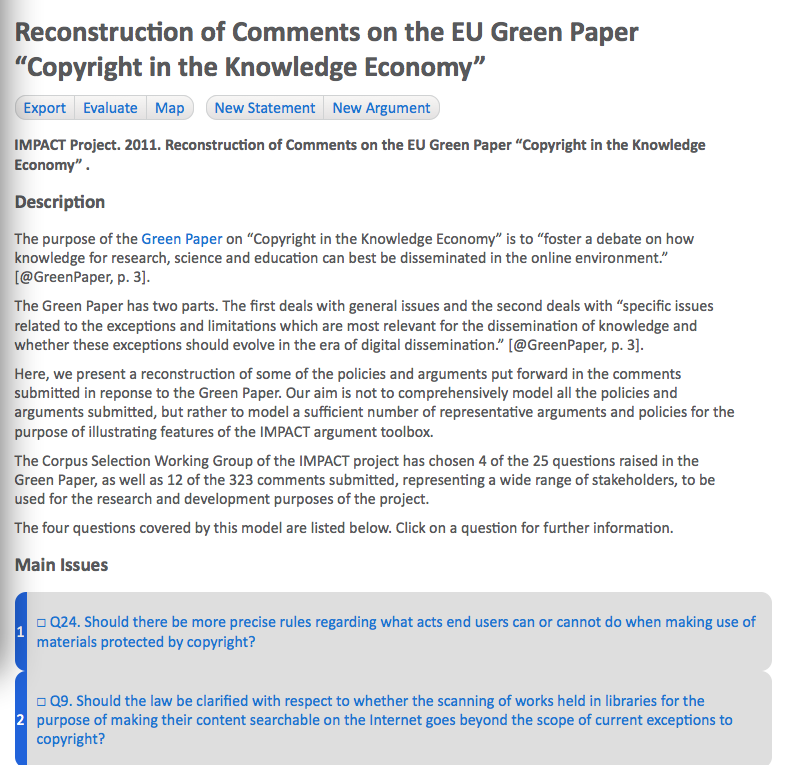

# Browsing, Visualizing and Evaluating Arguments

This chapter of the Carneades user manual explains how to:

- Access and use the [home page](#the-argument-graph-home-page) of an argument graph on the World-Wide Web.

- Use hypertext in web pages to [browse an argument graph](#using-hypertext-to-browse-an-argument-graph).

- [Visualizing argument graphs](#visualizing-argument-graphs-in-argument-maps) in diagrams, called "argument maps", and using these maps to navigate to more detailed views of statements and arguments.

- [Evaluate arguments](#evaluating-arguments) to reveal missing premises, check the form of arguments, ask critical questions and assess the acceptability of statements.

- [Export an argument graph to XML](#exporting-argument-graphs-to-xml), to archive the graph or process it using other software.

- [Generate outlines](#generating-outlines) of the arguments in a graph, for further editing using text editors or word processors.

## The Argument Graph Home Page

The user interface of Carneades is a web application.  You access the pages and views of the user interface with web addresses, called Uniform Resource Locators (URL), just like you access any resource on the World-Wide Web. Most of the time you will access the application by clicking on a link embedded in some page on the Web, for example in a news article, blog entry or e-participation web site. If you are using Carneades as a stand-alone, desktop application, these URLs will be local addresses, from the "localhost" domain, pointing to web pages served by the application on your personal computer.   

The home page of an argument graph consists of the following parts:

- The *title* of the argument graph.  This title usually includes the topic of the discussion or debate.

- A *menu bar* of commands.  The commands shown depend on the role of the user.  Public users, who need not login to the system, are shown the commands "export" and "map", for exporting the argument graph to XML and viewing an argument map visualization of the graph, respectively. Analysts, who must login to the system with a password, are also shown "new statement" and "new argument" commands. Only analysts may modify the argument graph.

- A *description* of the topic of the discussion modeled in the argument graph. The description may be available in several languages. The user interface provides a way to select and change your preferred language during the session (*not yet implemented*). The description can be arbitrarily long and include multiple sections, paragraphs, images, hyperlinks, lists and other content. 

- A list of the *main issues* of the discussion.  Each item in the list is linked to a page providing detailed information about the statement in the argument graph at issue.

- An *outline* of the top five levels of the arguments in the argument graph.The first level of the outline lists the main issues (again). The second level lists the arguments pro and con each issue. The third level lists the premises of each of these arguments. The fourth level lists the argument pro and con each premise.  Finally, the fifth level lists the premises of these arguments. Deeper levels of the argument graph can be navigated to by first clicking on a statement or argument in the outline and then following the links on the next page. Since argument graphs may contain cycles and are not restricted to trees, some items may appear multiple times in the outline.

- A list of *references* to the source documents used to construct the argument graph.  For documents available on the Web, the reference will include a hyperlink to the source document. 

## Using Hypertext to Browse an Argument Graph 

There is a web page for each statement and argument in the argument graph providing detailed information about the element along with links to related statements and arguments in the graph. You can use these pages to navigate from node to node in the argument graph, by simply clicking on the links in the usual way. To go back to previous pages, use the back button of your web browser.  

### Statement Pages

The top of the statement page displays the properties of the statement: its id, atom, whether or not it is a main issue, its proof standard, usually "pe" (preponderance of the evidence), its weight and value. The other proof standards available are "dv" (dialectical validity), "cce" (clear and convincing evidence), and "brd" (beyond reasonable doubt). See the section on [Evaluating Arguments](#evaluating-arguments) for further details about proof standards.

The next section displays the *text* of the statement. This formulation of the statement is written by the analyst or analysts who reconstructed the arguments to build the argument graph. 

If metadata had been provided for the statement, it would be displayed next. Descriptions may be entered, by analysts, in multiple languages. The description, if available, will be displayed using the language chosen by the user. If no description has been entered manually by analysts for the selected language of the user but a description is available in some other language, a translation service will be used to generate a description in the selected language (*not yet implemented*).  

Finally, the statement pages lists pro and con arguments about the statement, i.e. arguments having this statement, or its negation, as a conclusion, as well as arguments which have this statement, or its negation, as a premise.  The premises of the pro and con arguments are also listed. This makes it possible to navigate to nearby arguments and statements in the argument graph, by simply clicking on the links in these lists.  Use the back button of your web browser to return to this statement page.

### Argument Pages

Argument pages are quite similar to statement pages. The top of an argument page displays the properties of the argument: its id, the argumentation scheme applied (if any), whether it is a strict or defeasible argument, its weight and value. The argumentation scheme contains a hyperlink (*not yet implemented*). Click on the link to view a description of the scheme.

If metadata had been provided for the argument, it would be displayed next. Descriptions can include quotations of one or more source texts expressing the argument, along with hyperlinks to the sources on the Web. The description, if available, will be displayed using the language chosen by the user. If no description has been entered manually by analysts for the selected language of the user but a description is available in some other language, a translation service will be used to generate a description in the selected language (*not yet implemented*).  

Next, the premises of the argument are listed.  If available, the role of each premise in the argumentation scheme applied is shown (e.g. "major" or "minor"). The check boxes to the left of each premise are used to indicate whether the statement is current *in* (checked box, meaning presumably true), *out* (crossed out box, meaning presumably false) or neither (empty box, not enough information to presume either truth or falsity), given the arguments in the graph and the opinions of users from polls about the acceptability of statements and relative weights of pro and con arguments. 

After the premises, the conclusion of the argument is shown, preceded by "pro" or "con", showing the direction of the argument, and a check box showing the acceptability of the conclusion, as for the premises.

Finally, a list of counterarguments is shown.^[By counterarguments here we mean *rebuttals* (arguments with the opposite conclusion) and *undercutters* (arguments which deny the applicability of this argument).  Arguments which attack a premise of this argument ("undermining" arguments), are not listed. To navigate to undermining arguments, click on the premise of the argument of interest.  The undermining arguments will be listed on its statement page.]  The premises of the counterarguments arguments are also listed. This	 makes it possible to navigate to nearby arguments and statements in the argument graph, by simply clicking on the links in these lists.  You can use the back button of your web browser to return to this argument page.

## Visualizing Argument Graphs in Argument Maps 

The menus of the argument graph home page, statement pages and argument maps include a "map" button.  Clicking on the "map" button generates a diagram, called an "argument map", which visualizes the argument graph as a network (directed graph) of statement nodes and argument nodes connected by links. Statement nodes are shown as boxes; argument nodes with circles and boxes with rounded corners.

For statement nodes, the text of the statement is shown inside the box, possibly truncated if the text is too long.  In argument nodes, the circle is filled with a plus sign, if the argument is a pro argument, or a minus sign, for con arguments.    The edges (links) between argument nodes and statement nodes show the premises and conclusion of the argument. The conclusion of the argument is the statement node pointed to by the edge with the normal arrowhead. The other statement nodes linked to the argument, without arrowheads, are its premises.  Negative premises are displayed with a circular (dot) arrowhead on the statement side of the edge. 

The statement and argument nodes in argument maps contain hyperlinks. Clicking on a statement or argument node displays the details of the node in a statement or argument page, respectively. 

In argument maps, argument nodes whose conclusion is another argument node, rather than a statement node, visualize "undercutting" arguments. These are arguments which question the applicability of another argument. This is the only case where two nodes of the same time are directly connected in the map. 

Argument maps are represented using structured vector graphics (SVG) not bitmaps. You can zoom the map in or out, to any scale, without loss of resolution. How this zooming is done depends on your device and web browser.

When argument graphs have been evaluated, the status of the argument and statement nodes is visualized in argument maps using both color and icons. Nodes which are "in" are filled with a green background and contain a checked box.  Nodes which are "out" are shown with a red background and contain a crossed box (a box filled with an X). Nodes which are neither in nor out are filled with white background color and contain an empty checkbox. The colors are redundant to accommodate black and white printing and color-blind users.

Argument graphs may contain cycles. However, currently the algorithm used to layout the argument and statement nodes in the map is not able to handle cycles. *This limitation will be removed in a later version of the system.*

Argument graphs can be very large. Currently the *entire* argument graph is displayed in the argument maps. In the future only a partial view of the argument graph in maps will be shown, at least for larger graphs. The part of the graph shown will depend on the context. The map generated from the home page of the argument graph will show the arguments and statements near the main issues of the map. The maps generated from statement and argument pages will show the part of the argument graph near the selected statement or argument. A method for scrolling the maps, to bring other parts of the graph into view, will be provided.

## Searching for Arguments

The argument graph home page will provide access to a command for searching for arguments.

**Not yet implemented**

## Evaluating Arguments

By argument "evaluation" we mean the process of critically assessing arguments by 

- revealing implicit premises
- validating whether the arguments are formally correct, by instantiating accepted argumentation schemes
- asking appropriate critical questions, depending on the schemes applied
- and determining which claims are acceptable, taking into consideration the assumptions of the users and their collective assessment of the relative weights of conflicting pro and con arguments.

The first three of these tasks can be accomplished by comparing the argument with its argumentation scheme. On the argument page, click on the argumentation scheme to view a description of the scheme (*not yet implemented*). Most web browsers provide some way to open the link in a new tab, so that you can easily switch back and forth between the argument page and the description of the scheme. Now you can check whether any of the premises listed in the scheme are missing from the argument.  The argument is formally valid if all the premises of the scheme are explicitly provided by matching premises of the argument and the conclusion of the argument matches the conclusion of the scheme. 

Argumentation schemes define exceptions and assumptions which can be used to ask critical questions. The exceptions provide reasons for not applying the argument, undercutting it.  If an exception is true, this doesn't mean that the conclusion of the argument is false, but only that the argument does not provide a good reason to presume the conclusion to be true. The assumptions of the scheme are implicit premises which need to be proven only if they are called into question. So, if you think an assumption does not hold, you should consider making an issue of it using whatever channels are available for you for participating in the discussion. (The Carneades system does not provide this service. Its function is to provide a tool for summarising and understanding arguments, wherever they take place.)

The assumptions of the users and their collective assessment of the relative weights of conflicting pro and con arguments are collected and aggregated using the opinion polling tool described in the [opinion polling](#formulating-polling-and-comparing-opinions) chapter of this manual. At any time, an analyst can execute the "evaluate" command, shown in the menu bars of the argument graph home page, and the statement and argument pages, to compute the acceptability of the arguments and statements in the argument graph, on the basis of the information gathered from users via the polls. A statement is  considered acceptable if the users *should* believe it to be true given only the arguments modelled in the argument graph and their own assumptions and assessment of the relative weights of these arguments. 

If you do not agree with the result of the evaluation, there are at least three reasons why you may be right and the system's evaluation wrong:

1. Not all relevant arguments have been included in the model, or put forward in the debate. If you are aware of some missing argument, consider contributing it to the discussion yourself.

2. The collective, averaged opinion of the users who participated in the poll may be incorrect. Minority views can be correct. If you haven't yet participated in the poll, you may want to do so now.

3. The formal model of argument we are we are using to compute acceptability, based on the state of the art of the field of computational models of argument, may be incorrect. Of course, specialist knowledge is required to assess the correctness of the model.  If you, like most people, do not have this knowledge, then we recommend a skeptical but respectful attitude. If you agree with the results of the model, then the model gives you a reason to have more confidence in your opinion. If you do not agree with the results of the model, then you may want to take pause to reconsider your views, even if in the end you do not change your mind.

## Exporting Argument Graphs to XML

The menu bar of the argument graph home page and the statement and argument pages includes an "export" button. Click on this button to generate an XML file containing all the data and metadata in the argument graph, including quotations of and links to source documents.

The XML files use a schema called the "Carneades Argument Format" (CAF), documented elsewhere.  (* To do: write the CAF documentation*)

These XML files can be used to transfer argument graphs from one installation of the Carneades system to another, to merge argument graphs from several sources, to archive argument graphs, or to translate argument graphs into other formats, such as the [Argument Interchange Format](http://www.arg.dundee.ac.uk/aif) (AIF), or the generate reports or other kinds of visualisations..

## Generating Outlines

**Not yet implemented**
