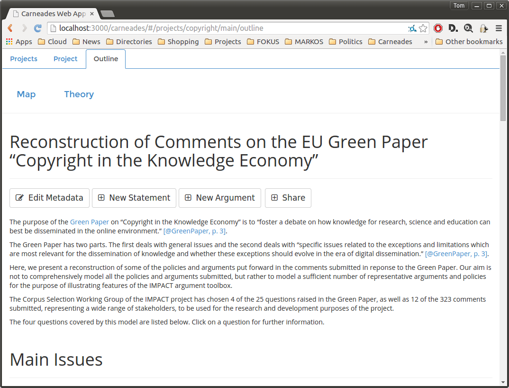
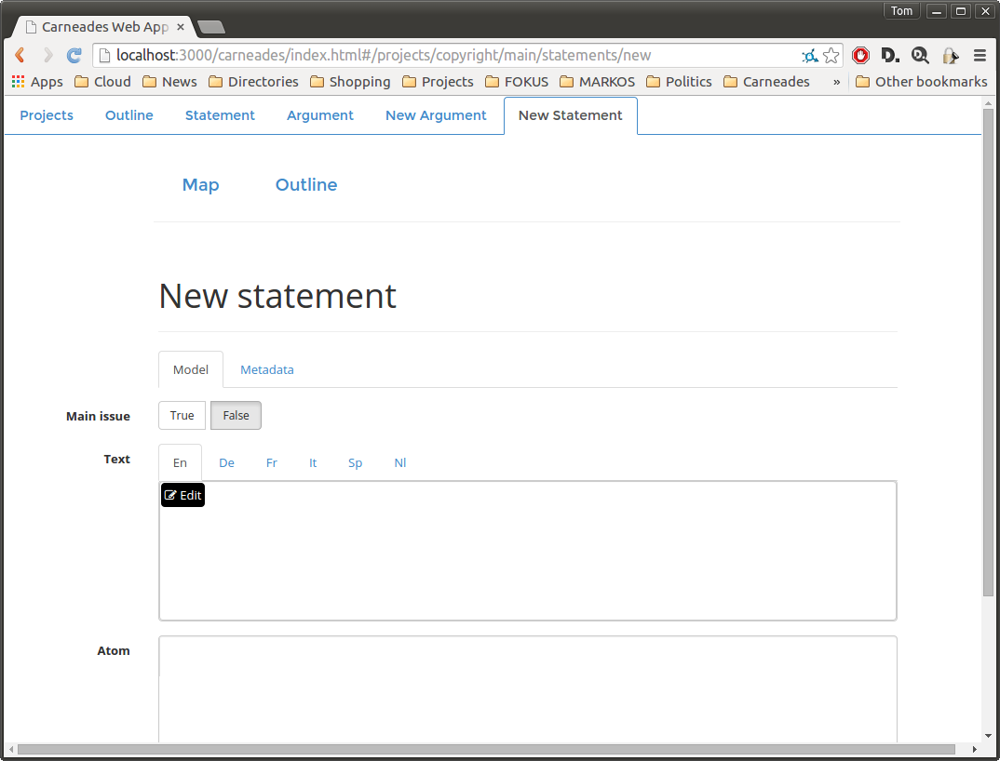
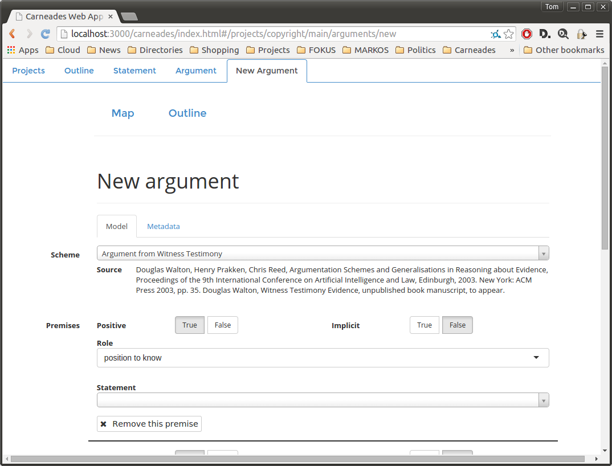

# Editing Argument Graphs

Normally, argument graphs can be edited only after logging into the system with a password. (*Note: the login form has not yet been implemented.  Currently all users are logged in automatically, sidestepping this protection.*) Interpreting source texts to reconstruct arguments using argumentation schemes requires some training. The editing functions of the system are intended for use by "analysts" with the required skills, not "public users". See the [Getting Started](#getting-started) chapter for a discussion of the different user roles supported by the system. System administrators can make the editing functions available to the public, if this is desired for some application. See the [System Administration](#system-administration) chapter for further information.

To edit an argument graph, first go to the argument graph page, as described in the Chapter entitled [Browsing, Visualizing and Evaluating Arguments](#browsing-visualizing-evaluating-arguments).

You can add nodes to the graph by clicking on the "New Statement" or "New Argument" buttons in the menu bar. In both cases you will be presented with a form to enter the required information. The form will be inserted and displayed at the top of the current argument graph page, so that you can scroll down to view information about the argument graph, without having to toggle back and forth between two tabs or pages in your web browser. See the [Entering New Statements](#entering-new-statements) or [Entering New Arguments](#entering-new-arguments) sections for further information.

To add a new argument pro or con some existing statement, go to the statement page and click on the "New Argument" button in its menu bar. The conclusion of the new argument will be set to the existing statement. Then complete the rest of the form as described in the [Entering New Arguments](#entering-new-arguments) section.

To edit or delete existing statements or arguments, first go to the page of the statement or argument and then click on the "Edit" or "Delete" button of its menu bar. Editing statements and arguments is done using the same forms used to create new statements and arguments. Deleting a statement will also delete the arguments pro or con the statement. Deleting an argument does not delete the conclusion or premises of the argument. This can leave some statements in the argument graph being unused in any argument.  

**Warning**: There is no undo function, so all editing and delete operations are permanent. However, you will be asked to confirm all delete operations and have the option of cancelling or saving editing operations.

## Reconstructing Arguments

To reconstruct a *new* argument in some source text, one which is not already in the argument graph, follow the procedure below. If instead the source text is *another formulation* of an argument already in the argument graph, you can modify the description of the existing argument to also quote this source.

1. Optional: If the source text is not already in the list of references of the argument graph, you can add it by following the instructions in the [Editing the Metadata and Reference List of an Argument Graph](#editing-the-metadata-and-reference-list-of-an-argument-graph) section of this manual. When doing so you will assign the source document a "key" (label). Remember or copy this key.
2. Click on the "New Argument" button in menu bar of the argument graph page.
3. Copy the text of the argument from the source document and paste it into the description field of the new argument form. You can quote the text of the argument, using [Markdown](http://daringfireball.net/projects/markdown/), by preceding each line with a ">" symbol. Be careful not the reveal the authors of the quoted source texts if you are planning to use the [opinion formation and polling tool](#formulating-polling-and-comparing-opinions), to avoid prejudicing the opinions of the users taking part in the poll. At the end of the quotation, cite the source document, using the key you assigned it when adding it to the list of references, using the [Pandoc extension of Markdown for citations](http://johnmacfarlane.net/pandoc/README.html#automatic-citations). For example, if the key is "BenchCapon:2011" the cite would have the form `[@BenchCapon:2011, pg. 5]`. The page number or numbers are optional. See the [Pandoc](http://johnmacfarlane.net/pandoc/README.html#automatic-citations) documentation for details.
4. Optional: You can choose an argumentation scheme to apply, from the pull down list of schemes in the argument editor. If you choose a scheme, its documentation will be shown and the form will be customized, with fields intialized for each of the premises, exceptions and assumptions of the scheme. You can modify the argument however you want, unconstrained by the chosen scheme, for example by deleting or adding premises, or renaming premise roles. The schemes are there to help you, not constrain you. You can however check whether the argument complies with the given scheme. See the [Validating Arguments](#vaidating-arguments) section for details. See the [Argumentation Schemes](#argumentation-schemes) chapter for documentation of the schemes included in the Carneades. These schemes may be modified or extended, or replaced entirely, as described in the [Modeling Policies and Argumentation Schemes](#modeling-policies-and-argumentation-schemes) chapter.
5. Enter the conclusion of the argument, either by choosing a statement already in the graph with the same meaning as the conclusion of the argument in the source text or by creating a new statement, by clicking on the plus (+) button to the right of the "select a statement" message. (Move the move over the "select a statement" message to see the plus sign, which is otherwise hidden.) If you create a new statement, you can either quote the conclusion of the argument in the "text" field of this new statement, or reformulate the conclusion in your own words.
6. Similarly, add the premises of the argument, either by choosing existing statements in the argument graph or by adding new statements. 
7. At the bottom of the form, click the "Save Argument" or "Cancel" button. **Warning:** Any changes you make using the form will not be saved to the argument graph until you execute the "Save Argument" command by clicking on this button. 

## Editing the Metadata and Reference List of an Argument Graph

(*Note: Not yet implemented.*)

## Entering New Statements

The form for entering new statements is shown when you click on the "New Statement" button in the menu bar of the argument graph page or on a plus sign (+) next to the conclusion or premise pull-down selection boxes for statements.  (The plus sign allows you to enter a new statement if the statement you need is not listed in the pull-down menu.)

A new statement should not be entered into the argument graph if the negation of the statement is already in the argument graph.  That is, for every proposition P, a single statement node should be entered into the graph to represent *both* P and ¬P. It doesn't matter whether the positive or negative form of the statement is included explictly in the argument graph. Typically the positive form is used, but in some cases you may prefer the negative form.  For example, you may prefer to include the sentence "The payment was illegal" explicitly in the argument graph and then represent arguments pro the legality of the payment as argument con the claim the payment was illegal. The best choice may depend on the procedural context of the debate. 

Only one form of the statement is required, since arguments pro the negation of the statement are equivalent to arguments con the statement. And premises of arguments can be explicitly negated in argument graphs, and in the forms for entering and editing arguments. This approach has the advantage of reducing the number of statements in the graph up to 50%.

### Statement Description

You can use the *description* field to provide whatever background information you want about the statement. Unlike the mandatory "text" field (see below), this information is optional. You can structure and format the description, including headers, lists, quotations, hypertext links and other elements, using the [Markdown](http://daringfireball.net/projects/markdown/) wiki language. The form includes a Markdown editor to make this easier for you.  You can enter translations of the description. There is a tab of the description form for each available language. (The set of languages can be configured by system administrators when installing the system. *Note: not yet implemented.*) The system is preconfigured for the following languages:

En
:   English
De
:   German
Fr
:   French
It
:   Italian
Nl
:   Dutch
Sp
:   Spanish

### Statement Metadata

Statements can be annotated with metadata properties, using the [Dublin Core](http://en.wikipedia.org/wiki/Dublin_Core) metadata elements.  The Dublin Core elements are briefly summarized in the [Metadata](#metadata) section of this manual.

To add a metadata element to a statement, select the element from the pull-down menu and click on the "Add" button. A text box for entering the value of the element will be added to the form. Multiple values of an element can be added by clicking on the "Add" button as often as needed. A value can be deleted by clicking on the "x" icon to the right of the value.

### Atoms: Formalizing Statements using Predicate Logic

Optionally, statements can be formalized in predicate logic, by providing a value for the "atom" property in the form. This is an advanced feature that may be needed only for more specialized application scenarios.

Atoms are formalized in Carneades using the prefix notation of [s-expressions](http://en.wikipedia.org/wiki/S-expression) ("symbolic expressions"), as in the Lisp family of programming languages.

For example, Socrates is a man could be formalized as `(man Socrates)`. Here, `man` is a unary predicate symbol.  The fact that Socrates died in 399 B.C. could be represented using a binary predicate, for example as `(died Socrates -399)`.  

The language for Atoms is quite expressive:
	
- The arity of atoms can be 0 or more, as in predicate logic, not restricted to unary and binary predicates, as in description logic, RDF and OWL.  Examples: `(good)`, `(between 0 1 2)`.
- Compound terms may be used.  For example `(= 2 (+ 1 1))`. The is, the atom language is not restricted to Datalog.
- Atoms can be higher-order.  Example: `(believes Gerald (and (made-of Moon green-cheese) (really-exists Yeti)))`.  Notice that compound propositions can be reified as terms, as in this example. 

If you choose an argumentation schemes to use as a template when editing arguments, the statements of the argument will be initialized with atom schemas.  These are atoms with schema variables, represented by strings starting with a question mark, such as `?x`.  If your application does not make use of atoms, you can simply ignore the atoms, or delete them, as you prefer.  If your application does use atoms, you need to substitute the variables in the schemas with constants from your application domain, where constants are represented by symbols not beginning with a question mark, such as `work1`, or numbers. 

### Statement Text

The "text" property of a statement node of an argument graph is for expressing the statement concisely in natural language. You should always provide such a text.  As for descriptions, translations of the text in several languages may be included in the model and the statment may be structured using  [Markdown](http://daringfireball.net/projects/markdown/). (*Note: the tabs for entering the text is more than one language is not yet implemented. Update the screenshots when this has been fixed.*)  This is the text that will appear in statement boxes in argument maps and in hypertext views of the argument graph. Whereas descriptions are optional and part of the *metadata* about the statement, this text is the *data* representing the statement itself.

### Proof Standard

The proof standard of a statement determines how much proof is required for the statement to be deemed acceptable (presumably true). The proof standard is used by the computational model to argument to compute the acceptability of the statement. Several proof standards are available:

Preponderance of Evidence (pe)
:   This standard is meet if at least one pro argument is *in* that weighs more than any *in* con argument.  (Only arguments pro or con this statement are compared.)

Clear and Convincing Evidence (ce)
:   This standard is satisfied if the preponderance of evidence standard is meet and, in additional, the difference between the strongest *in* pro argument and the strongest *in* con argument is above a certain threshold.

Beyond Reasonable Doubt (brd)
:   This standard is meet if the clear and convincing evidence standard is meet and, in addition, the weight of the weakest *in* con argument is below a certain threshold.

Dialectical Validity (dv)
:   This standard is the only one that does not make use of arugment weights. It is satisfied if at least one pro argument is *in* and no con argument is *in*. 

The default proof standard is preponderance of the evidence, and for most applications this proof standard should be sufficient. Note that the preponderance of evidence standard is meet whenever the dialectical validity standard is met. If arguments are not weighed, the dialectical validity and preponderance of evidence standards will give the same results.  The preponderance of evidence, clear and convincing evidence and beyond reasonable doubt standards are ordered by the amount of proof required, with beyond reasonable doubt requiring the most proof. Whenever one of these standards is meet, any weaker standards are also meet.

### Main Issue

An argument graph should have at least one main issue.  These are the issues which are central to the debate.  All the other issues are subsidiary issues only important to the extent that they are relevant for resolving one of the main issues. 

The main issues are offered as entry points on the argument graph page and by the "guided tours" of the opinion formation and polling tool.

The make the statement a main issue, click on the "Yes" radio button next to the "Main" label in the statement editor.

### Statement Weight

The weight of a statement encodes the extent to which users agree or disagree with the statement, on a scale of 0.0 to 1.0, where 0.0 represents disagree (reject), 0.5 means no opinion and to 1.0 is denotes agree (accept).  

The weight can be entered directly in the statement editor, using a slider. This can be useful for exploring interactions among the arguments given various assumptions. Alternatively the public users can be polled for their opinions and the results of the poll can be averaged to compute the weights. See the [Using Polls to Weight Statements and Arguments](#using-polls-to-weight-statements-and-arguments) section of this chapter for further information.
	
## Editing Statements

To edit an existing statement in an argument graph, first navigate to the statement, using either the hypertext view of the graph, beginning on the argument graph page, or the argument map. In the map view, click on the box containing the statement you want to edit.

Either way you will now be viewing the statement page.  Click of the "Edit" button in the menu bar of the page.  This will reveal, on the same page, a form for modifying the statement.  This is the same form used to enter new statements, described in the [Entering New Statements](#entering-new-statements) section of this chapter, but with the fields of the form filled in with the current values of the properties of the statement. After making changes, click on the "Save Statement" button at the bottom of the form, to have the changes stored in the argument graph database, or the "Cancel" button to abort the editing process and retain the prior values of the properties of the statement.

**Warning**: The changes cannot be undone after saving them.

## Deleting Statements

To delete a statement from an argument graph, first navigate to the statement, using either the hypertext view of the graph, beginning on the argument graph page, or the argument map. In the map view, click on the box containing the statement you want to edit.

Either way you will now be viewing the statement page.  Click of the "Delete" button in the menu bar of the page.  You will be asked to confirm or cancel the deletion.  

**Warning**: The deletion cannot be undone after it has been confirmed.

**Warning:** Deleting a statement also deletes all arguments pro or con this statement, i.e. with this statement as the conclusion of the argument. The statements for the premises of these arguments are not deleted.

## Entering New Arguments

The form for entering new arguments is shown when you click on the "New Argument" button in the menu bar of the argument graph page or a statement page.  When used on a statement page, the form for entering the new argument will be initialized with the statement as the conclusion of the argument.

See the section on [Reconstructing Arguments](#reconstructing-arguments) for tips about how to proceed when interpreting and modeling arguments in source texts.

### Argument Description

You can use the *description* field of the argument to provide whatever background information you want about the argument, including quotations of formulations of the argument in source texts, along with hyperlinks to the sources. 

You have the same possibilities for structuring the text of the description, using the [Markdown](http://daringfireball.net/projects/markdown/) wiki language, and entering translations of the description as you have for statement descriptions. See the [Statement Description](#statement-description) section of this chapter for further information.

If you plan to use the argument graph with the [opinion formation and polling tool](#formulating-polling-and-comparing-opinions), be careful to formulate the descriptions in a way which does not risk prejudicing the answers by revealing the authors of quotations. Reference the source of the quotation using  using a citation key. See the section on [Reconstructing Arguments](#reconstructing-arguments) for further information.

### Argument Metadata

Arguments can be annotated with metadata properties, using the [Dublin Core](http://en.wikipedia.org/wiki/Dublin_Core) metadata elements, in the same way as statements. See the [Statement Metadata](#statement-metadata) section for further instructions.

### Argument Direction

Arguments can be *pro* or *con* their conclusion.  An argument con a statement is semantically equivalent to an argument pro the negation of the statement.  Select the direction of the argument in the form using the radio buttons.

### Strict or Defeasible Arguments

An argument may be *strict* or *defeasible* (not strict).  An argument is strict if and only if its conclusion must be true, with no exceptions, if its premises are true, whether or not its premises are in fact true.  For example the following arguments are strict:

- The moon is made of green cheese since the moon is made of green cheese and unicorns have horns.
- The figure is a triangle since it has three sides.

The first example argument is of course cyclic, not to mention fanciful. But it is strict nonetheless.

Arguments are defeasible if they are not strict. With defeasible arguments, the conclusion is only *presumably* true when the premises are true. The argument gives us a reason to accept the conclusion, but there may be exceptions or other reasons leading to the opposite conclusion.  Here are a couple of famous examples from the computational models of argument literature:

- The object is red since it looks red.
- Tweety flies sinces Tweety is a bird.

The object may look red because, for example, if is being illuminated by a red light. And Tweety the bird may be a penguin, or have a broken wing, and so on.

The conclusion of a defeasible argument need not be *probably* true, in some statistical sense.  It is not necessary to have good empirical data allowing us to draw conclusions about what is probably the case in order to make a defeasible argument.  The argument only needs to give us some good reason to believe the conclusion, at least until we have heard arguments giving us reasons to the contrary.

Select whether the argument is strict in the form using the radio buttons. By default, arguments are defeasible.

### Argument Weight

Argument weights only become important when two or more arguments with contradictory conclusions, that is arguments pro and con some conclusion, come into play. Such arguments are called "rebuttals".  The conflict between the rebuttals is resolved by weighing the arguments and applying proof standards. See the [Proof Standard](#proof-standard) of this chapter for further information.

The weight can be entered directly in the argument editor, using a slider. This can be useful for exploring interactions among the arguments and experimenting with the effects of different proof standards. Alternatively the public users can be polled for their opinions and the results of the poll can be averaged to compute the weights. See the [Using Polls to Weight Statements and Arguments](#using-polls-to-weight-statements-and-arguments) section of this chapter for further information.

### Using Argumentation Schemes

Arguments can be entered into the system, without using argumentation schemes. Their use is entirely optional. That said, argumentation schemes can be helpful for interpreting source texts when trying to reconstruct arguments. They serve as templates which can guide you in your task of understanding the source text. For example, if the argument looks like it might be an argument from expert opinion, using the expert opinion scheme will help you to remember the conventional form of this kind of argument. Can the text reasonably be understood as including all the premises of the expert witness scheme? Were any missing premises left implicit by the author, or would this be reading too much between the lines? Does the argument perhaps better fit some other scheme?

See the section on [Reconstructing Arguments](#reconstructing-arguments) for tips about how to proceed when interpreting and modeling arguments in source texts.

You can view a list of the available argumentation schemes using the pull-down menu. Type in a string, such as "expert", to display the schemes containing the string in the title. Then select the desired scheme from the list. This will display a description of the scheme, perhaps with example arguments, along with references to publications about the scheme. You can go back and select another scheme at any time. 

Whenever a scheme is selected, the form will customized to include premises and exceptions fields for the chosen scheme. The roles of the premises and exceptions will be modified to match the selected scheme. The premise roles can be edited. You are not constrained by the scheme.

If you change your mind and select another scheme, any statements you have selected for the conclusion, premises and exceptions of the argument will remain selected, but you will need to check whether they are still appropriate and select or add other statements if necessary.

Again, the argumentation schemes are meant to be helpful, not get in your way. They do not constrain you to enter arguments matching the schemes.  You can, however, check whether arguments correctly instantiate the schemes they have been assigned. See the [Validating Arguments](#validating-arguments) section for further information.

### Entering Premises and Exceptions

In the premise and exception fields of the form, you can choose an existing statement in the argument graph or click on the + icon shown on the right-hand side of the field, when you move the mouse cursor over the field, to open up a form for entering a new statement. When you add a new statement, its "atom" property will be initialized with a predicate logic formula. If you are interested in formalizing the statements, you can use this formula as a template, replacing its schema variables with constants, or edit the formula to meet your own requirements. If you don't need to formalize statements, you can either delete the atoms or just ignore them.

You can additional premises or exception by clicking on the "Add a  premise" and "Add an exception" buttons.  Premises and exceptions can be deleted by clicking on the X icon shown on the right-hand side of the premise or exception field, when you move the mouse cursor over the field. 

## Editing Arguments

START HERE

## Validating Arguments
## Deleting Arguments

## Using Polls to Weigh Statements and Arguments

Public users can be polled for their opinions and the results of the poll can be averaged to compute the weights of statements and arguments. See the [Formulating, Polling and Comparing Opinions](#formulating-polling-and-comparing-opinions) chapter for further information about polls. 

To compute the weights of statements and arguments from the poll results, go to the argument graph page and click on the "Weigh" button in the menu bar. (*Note: not yet implemented.*)  Afterwards you may also want to re-evaluate the argument graph to update the acceptability labels of the statement and argument nodes, as explained in the [Evaluating Argument Graphs](#evaluating-argument-graphs) section.

##  Evaluating Argument Graphs

Computing Acceptability and Labeling

## Importing XML

(*Note: XML import, unlike XML export, is not yet implemented.*)

The Carneades Argument Format (CAF) is an XML schema for storing argument graphs in files, in a structured but plain text form which can be read or edited by humans, using any text editor, that is also suitable for machine processing.

To facilitate moving statements and arguments between argument graphs, across installations of the Carneades system, every statement and argument is assigned an [Uniform Resource Name](http://en.wikipedia.org/wiki/Uniform_resource_name) (URN).  URNs are identifiers which are extremely likely to be unique, world-wide.

(*Note: Write a reference manual describing the CAF format.*) 

For information about how to *export* argument graphs to XML, see the [Exporting Argument Graphs to XML](#exporting-argument-graphs-to-XML) section of this user manual.

To import a CAF file, navigate to the argument graph page and click on the "Import" button in the menu bar. You be asked to select a file from your file system.  The selected filed will be validated to make sure that it is a valid CAF file. It if it is valid, it will be used to update the argument graph, as follows.  

1. First, you will be asked if you want to *merge* or *overwrite* the data in the argument graph in the database with the data in the CAF file.
2. If you choose to *merge* the data:
	- The properties of statements or arguments in the argument graph will be *replaced* by the values of the same properties in the CAF file but the values of properties undefined in the CAF file will retain their current values in the database. (**Note**: all values of a multivalued metadata property will be *replaced* by the values of the property in the CAF file. The values of individual properties are not merged.)
	- Any new statements or arguments in the CAF file will be added to the database, without deleting statements or arguments in the database which are not in the CAF file.
	- The metadata of the argument graph as a whole will be updated using the metadata in the CAF file. Properties of the argument graph will be replaced by the values of the same properties in the CAF file. (**Note**: If a property has multipled values, they will all be replaced, not merged.) Properties not in the CAF file will retain their current values in the database. 
	- References of the argument graph in the database will be replaced by references with the same keys in the CAF file, but references in the database which are not in the CAF file will be retained, not deleted.  
3. If instead you choose to *overwrite* the data:
	- The properties of statements or arguments in the argument graph will be *replaced* by the values of the same properties in the CAF file and properties undefined in the CAF file will be deleted in the database. (**Note**: all values of a multivalued metadata property will be *replaced* by the values of the property in the CAF file. The values of individual properties are not merged.)
	- Any new statements or arguments in the CAF file will be added to the database, without deleting statements or arguments in the database which are not in the CAF file.
	- The metadata of the argument graph as a whole will be updated using the metadata in the CAF file. Properties of the argument graph will be replaced by the values of the same properties in the CAF file. (**Note**: If a property has multipled values, they will all be replaced, not merged.) Properties not in the CAF file will be deleted in the database. 
	- References of the argument graph in the database will be replaced by references with the same keys in the CAF file and references in the database which are not in the CAF file will be deleted.
	
(*Note: Look for a simpler solution.*)

