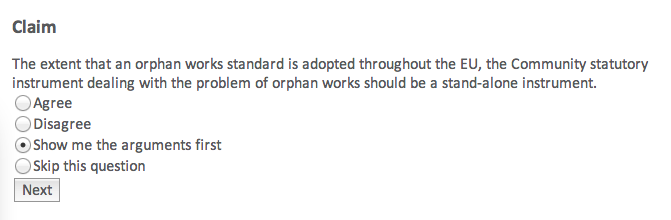
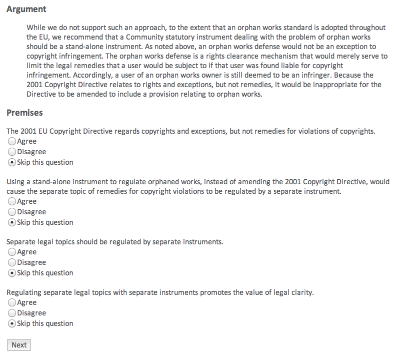
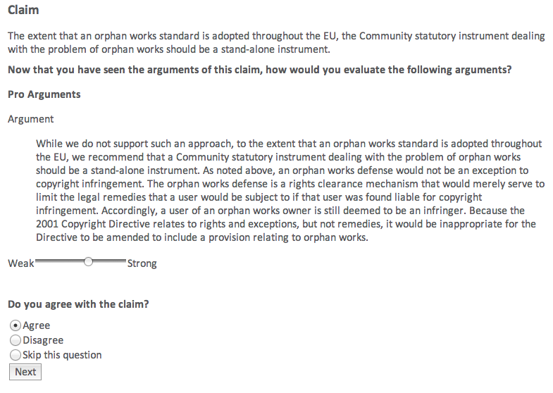
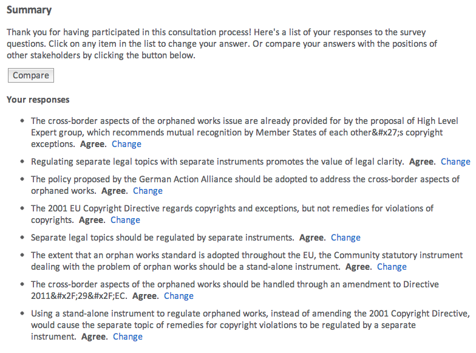
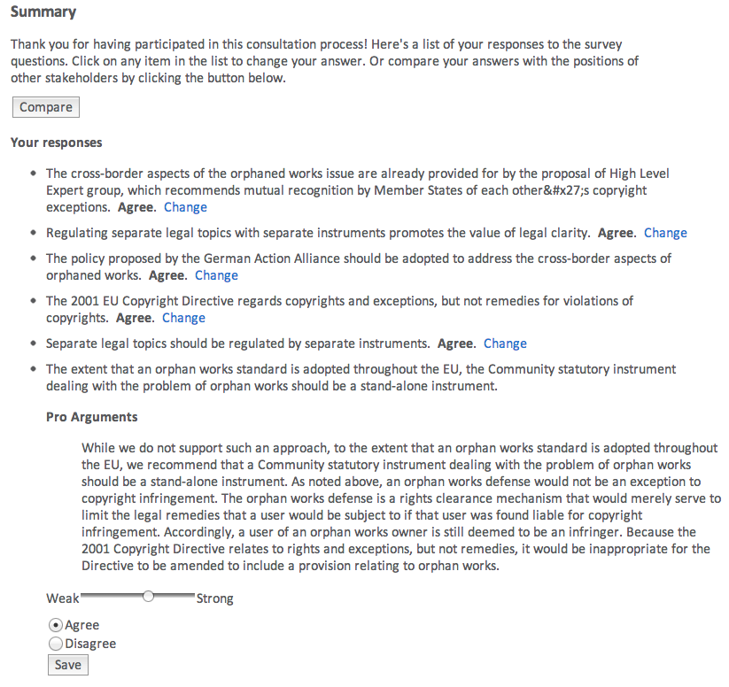
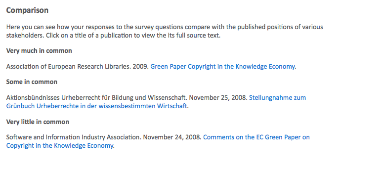

# Formulating, Polling and Comparing Opinions

The opinion formation and polling tool of the Carneades system  serves two purposes:

- It guides you step by step through the arguments on all sides of a
complex policy debate, in a kind of simulated debate, providing you with an overview of the issues, positions and arguments in a systematic way. The tool can help you to form your own opinion, if you don't yet have one, or to critically evaluate and reconsider your current opinion, if you do. The tool also enables you to compare your responses with the published positions of some stakeholders, such as political parties, helping you to find persons and organizations which best represent or share your views and interests.

- At the same time the tool conducts a poll to collect your views and opinions on the issues, taking care to protect your privacy. You will not be asked or required to enter any personal data, such as your name or email address, which could be used to identify you or associate your answers to poll questions. The anonymous and aggregated results of the survey can provide valuable feedback to you as well as policy makers, going beyond the information provided by traditional surveys. It enables users to discover not only how much support policies enjoy, but also to learn precisely why particular aspects of the policies, or their underlying assumptions, are supported or not.

## Accessing the Opinion Formation and Polling Tool

Every page of the Carneades system includes the main menu. Click on the "poll" button of the main menu to access the opinion formation and polling tool. 

The first page of the opinion formation and polling tool provides an overview of the features of the tool and explains the following procedure for using the tool:

1. Log in using a pseudonym to protect your privacy. You can login again using this name to change your responses at any time. Choose  a cryptic name, like a secure password, to make it difficult for others to access or change your answers. (The system will generate a username for you, which you can use or change, as you prefer.)
	    
2. Read an introduction to the topic of the debate and select an issue of interest.
		
3. Answer a series of survey multiple-choice questions about the selected issue, asking you whether you agree or disagree with claims made in arguments. To help you to formulate or reconsider your opinion, you have the option to first view quotations of formulations of the arguments from the source documents. No information about the authors of the quotations will be shown during this phase, to allow the arguments to speak for themselves and avoid prejudicing your answers. (The authors will be revealed at the end, when comparing your opinions to theirs.) The system will inform you about your progress and estimate the remaining number of questions. The precise number of questions may vary, as the order and number of questions depends on your answers to prior questions. You decide how deep to delve into the issues and can control how much time to spend answering poll questions. 
		
4. View a summary of the questions and your responses. You are provided with an opportunity to change your answers.
		
5. Compare your opinions with those of the authors of the source documents used to create the argument graph. Rank the authors of the source documents, such as political parties, by how much they agree or disagree with your opinions. You can click on the titles of the source documents to download and view their full text and check for yourself the extend to which your agree or disagree with the claims made.

This procedure is flexible and you are in control. You are the moderator of the virtual debate. You can stop at any time, and continue later if you'd like, or jump backwards or forwards to any step in the procedure.  

## Question Types

Three types of questions are asked during the poll. The questions are generated automatically by traversing, in a systematic way^[depth-first], the nodes of the argument graph. The first time you are asked for your opinion about some statement, you will be asked whether you 

- agree with the statement
- disagree with the statement
- want to first see the arguments pro and con the statement before expressing an opinion, or finally
- want to skip this issue and go on the next.

If you first want to see the arguments before answering, and thus choose the third alternative, then the question will be put aside and you will be shown questions about the arguments pro an con this statement. This second type of question shows you the argument, quoting the formulations of the argument in the source texts, and asks you whether you agree or disagree with its premsies.

After you have seen the arguments, to the depth and level of detail you choose, you will be asked again for your opinion of the statement. This second time, however, the question is formulated somewhat differently. You will first be asked to weigh the arguments pro and con the statement which you have agreed are good  arguments, that is arguments whose premises, in your opinion, are true. You can easily adjust the relative weights of these arguments, using sliders, as shown in the figure. 

After you have weighed the arguments, you will be asked, at the bottom of the same page, whether you

- agree with the statement
- disagree with the statement, or
- want to skip this issue and not express and opinion

Please be careful to take your own assessment of the relative weights of the pro and arguments into consideration when answering the question, remembering that these are all arguments you agree with, even if they happen to conflict. Weigh the arguments to resolve the conflict and justify or explain your opinion.

## Checking and Changing Your Answers

To check or change your answers go to the "summary" page, by clicking on the "summary" menu item of the menu bar. 

The summary page lists all the statements with which you have agreed or disagreed, showing your opinion.^[The statements you skipped, without expressing an opinion are not listed. (*Note: Not yet implemented: some way for the user to review and answer the skipped questions, including taking a tour of the arguments about the skipped questions.*)]  To change your opinion about some statement, click on the "change" button next to the statement.  This will reveal, inline on the same page, a summary of the pro and con arguments you agree with about the statement and give you an opportunity to adjust the weights of these arguments and change your opinion of the statement. Try to take care to make sure that your new opinion remains consistent with the relative weights you assign to the pro and con arguments. 

After you have changed your opinion, or cancelled the dialog, the arguments will be folded away, out of view, and you can continue checking your other answers where you left off.  

## Comparing Your Opinions with Others

To compare your opinions with those expressed in the source documents used by the analysts to build the argument graph, click on the "compare" button in the menu bar of the opinion formation and polling tool. This will take you to a page showing the source documents grouped into several categories, ordered by how much the  opinions expressed in the documents have in common with your opinions, based on your answers to the poll questions. 

In each category, full references to the documents are provided (author, title, etc).  The title includes a hyperlink to the source of the document on the Web. You can click on the title to download and read the original document, to judge for yourself how much you agree or disagree with the opinions expressed in the document.   

The rest of this section explains briefly how the comparison is computed. 

All of the arguments modeled in the argument graph are tagged with the keys of source documents in which the argument has been made, from the corpus of source documents used by the analysts to construct the graph.^[These keys are stored in the "source" property of the metadata of arguments. The keys are the identifiers of the metadata records for documents in the references section of the argument graph.] These documents do not merely cite or quote the argument. They express agreement with the argument, by claiming that the premises and the conclusion of the argument are true. Since the arguments are linked to their conclusion and premises in the argument graph, it is easy to compute from the source metadata of arguments the set of claims, i.e. statements claimed to be true or false, in each source document. These claims are then compared to your opinions, based on your answers to the poll questions.^[The similarity of opinions is measured by the percentage of claims in the document with which you have expressed agreement. We may replace this with some other  metric, such as "Euclidean distance" [@Seagaran:2007, pp. 9-15], in a future version of the system.]

