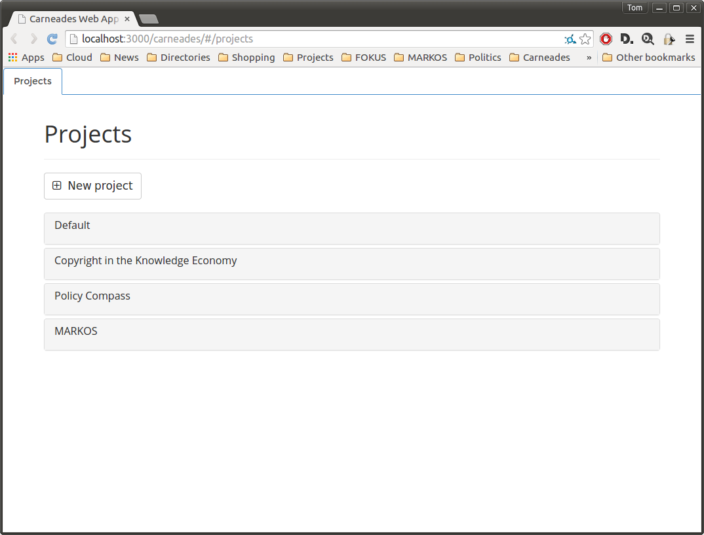

# The Projects Page

The projects page is the first page shown in your Web browser when you
start Carneades. It lists example projects and the projects you have
created, and provides a way to create new projects.

To access a project, click on its name in the list of projects.

To create a new project, click on the "New Project" button, complete
the form and then click on the "Save" button.

The "theory" field allows you to specify which argumentation schemes
to use to construct and reconstruct arguments. It is initialized to
use model of Walton's argumentation schemes distributed with the
system, from the default project: "default/walton_schemes".

Projects are store in files on your file system the directory
specified in the "carneades.clj" file in your home directory. See the
System Administration chapter for further configuration details.

You can change the theory to use other argumentation schemes,
including ones you have written yourself. See the "Argumentation
Schemes" chapter for information on how to write theories with your
own argumentation schemes. Save or move the theory to the "theories"
directory of your project, in the projects directory specified in your
"carneades.clj" configuration file. Suppose you have named this theory
"my_schemes.clj" and stored it in the theories directory of your
project. To have this theory used by your project, instead of
"default/walton_schemes", edit the "properties.clj" file in the
project directory and then change the theory to "my_schemes".  Notice
that you need not name the project, since the theory is in this
project, and you also should not add the ".clj" (Clojure) file
extension. (Theories are implemented using a rule language embedded in
the Clojure programming language.) This must be done locally on the
computer running the Carneades server. There is currently no Web
user interface for editing the properties of projects or managing the
theories of projects.

